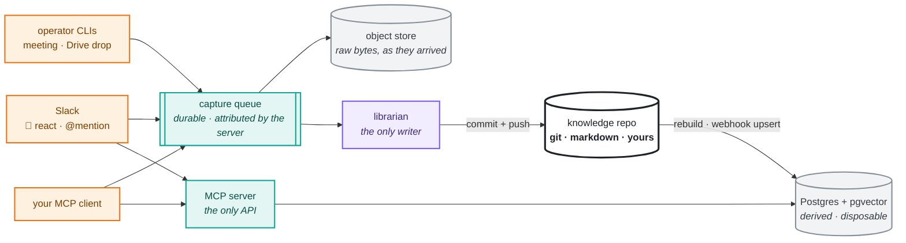
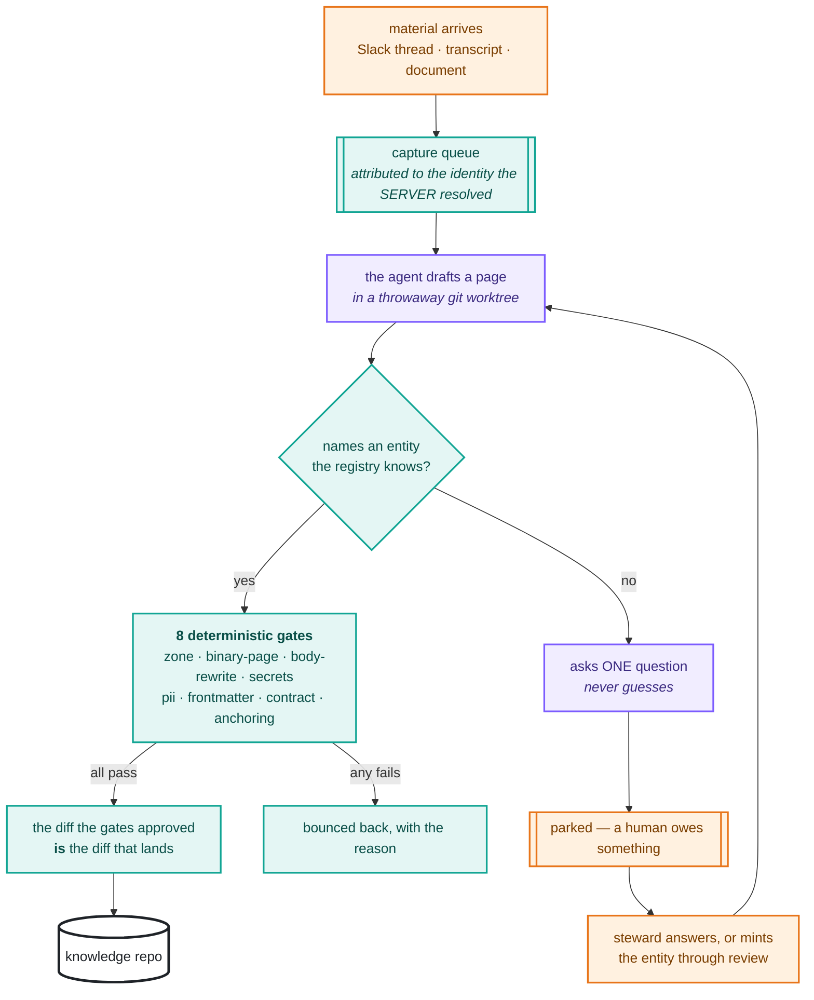
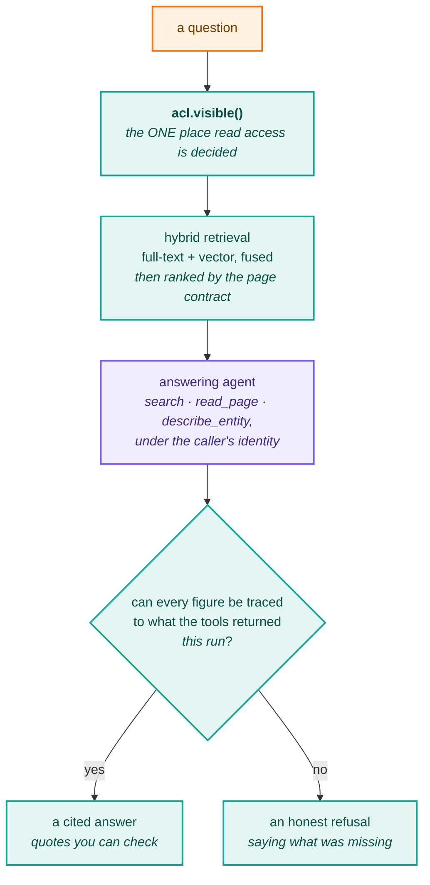

# Stigmergy


**A team's knowledge, captured where the work happens, filed by an agent, and answered with
citations you can check.**

Notes, meeting transcripts and documents arrive from Slack or a CLI. An agent turns each one into a
page in a plain git repository — but *code*, not the model, decides what is allowed to land. Reads
go through a single MCP server that answers questions with sources, and refuses when it cannot
support an answer. Everything it stores is a markdown file in a repo you own.

## The idea, and what a team does to it

The starting shape is Andrej Karpathy's **LLM wiki**: instead of re-deriving an answer from raw
sources on every question, let a model keep a markdown wiki current — reading each new source,
folding it into the pages it touches, and maintaining the cross-references. It works for a reason
worth stating plainly: a model does not get bored doing the bookkeeping, and that bookkeeping is
precisely the chore that makes people abandon wikis. Knowledge then compounds in one place rather
than being recomputed per query. *(Original write-up:
[karpathy/442a6bf5…](https://gist.github.com/karpathy/442a6bf555914893e9891c11519de94f) — the idea
is restated here in full, because nothing this repository explains should depend on a link.)*

That model assumes one person, curating their own vault. Point it at a **team** and three things
stop being optional:

**A mistake is now somebody else's problem.** In a personal vault a bad edit costs you one undo. In
a shared one it quietly becomes what the company believes, and the person it misleads is not the
person who made it. That asymmetry is why nothing here is left to the model's judgement — the next
section is the whole answer.

**The vocabulary has to be agreed, not coined.** A solo wiki can let the model invent a page for
every name it meets. With several writers that yields three pages for one customer under three
spellings, and every link pointing at the wrong one. Here an entity is **born through a human**: the
agent proposes, a steward approves in Slack, and only then does a governed writer mint the page and
the registry entry. A capture naming something unknown parks and asks — once — rather than guessing.

**Not everyone may read everything.** A team wiki holds salaries, board material and a customer's
confidential figures. Visibility is enforced at one point (`acl.visible()`), on every read surface,
by an architecture test that refuses to let a new reader skip it — and an unknown page and a
forbidden page return the same string, because *which* one it was is itself a leak.

## Why it is built this way

Three commitments, and most of the design falls out of them:

**Knowledge lives in git, as markdown, in a repository you control.** This platform stores no pages.
It reads and writes a *separate* repository — the knowledge repo — so the substrate outlives the
software. Delete this platform and you still have your knowledge, in files, with history.

**A model writes; code decides.** An agent drafts the page, but eight deterministic gates run over
the resulting diff — zone, binary-page, body-rewrite, secrets, PII, frontmatter, contract,
anchoring — and the diff those gates approved is provably the diff that lands. A model can be
argued with. A gate cannot.

**An honest refusal beats a confident guess.** Answers are verified against what the tools actually
returned *this run*: any figure that cannot be traced back is withheld and the answer becomes a
refusal that says so. A system that never refuses is the failure, not the success.

There is a fourth, quieter one: **untrusted content is never read as instructions.** Everything a
model sees is wrapped by one hardened fence, built in one place, with in-band neutralization — so
captured material containing the closing delimiter cannot end the fence early and have the rest
read as commands.

## Architecture

Three pictures. They use one convention, and it is the argument of the whole system rather than
decoration: **colour is who decides.**

| | |
|---|---|
| 🟪 **the model** | drafts, gathers, proposes. Never the last word on anything. |
| 🟩 **code** | decides. Deterministic, testable, and the same answer twice. |
| 🟧 **a human** | the cases code should not decide alone — and the queue is honest about owing them. |
| ⬛ **git** | where knowledge actually lives. Everything else is rebuildable. |

### The shape



**Read that diagram by asking what survives deleting this software.** The knowledge repo does: it
is markdown in git, with history, and it is yours. Postgres is a cache — `stigmergy-index --rebuild`
reconstructs every row of it from the repo, which is why the local one can be wiped between test
runs without anybody flinching. The object store keeps the raw bytes a page was derived from, so a
claim can always be walked back to what actually arrived.

Two narrow seams do all the work: **one writer** into git, and **one API** out of it.

### The write path



The purple box is the only place a model decides anything, and everything downstream of it is a
gate it cannot argue with. **The loop back through orange is the point of the whole design**: when
the agent meets a name the registry does not know, it does not invent a page — it asks once, parks,
and waits for a person. A queue whose parked count is permanently zero would mean nobody is
capturing anything.

`brain_submit` queues a capture, archives its raw material content-addressed (MinIO locally, any
S3-compatible store in production) and attributes it to the identity the **server** resolved — never
to anything the client sent. The librarian then claims one item at a time and runs the agent inside
a throwaway `git worktree`, with its operating procedure versioned as a skill in the knowledge repo.

Then code decides what leaves: **eight gates** over the resulting diff — zone · binary-page ·
body-rewrite · secrets · pii · frontmatter · contract · anchoring — and the diff the gates approved
is provably the diff that lands (`gitcmd.commit(gated_entries=…)`).

Nothing dead-ends. A librarian that cannot resolve an entity **asks** once (`brain_reply`), then
parks the item; a steward drains it with `stigmergy-queue requeue/resolve/reject` or from the review
inbox; and `stigmergy.entities` is the only writer of the entity registry, however the mint is driven. A meeting re-filed after a
park **reuses the parked distillation** instead of re-reading the transcript — a park must not cost
knowledge.

Two flows sit on top: the **meeting distiller** (a dropped transcript becomes a source page, a
meeting page and one decision page per decision, each anchored) and **views** (per-entity rollups
whose ACL is the intersection of their members').

### The read path



Same shape, mirrored: a model gathers, and code decides what ships. Access is checked *before*
retrieval rather than filtered out of the results afterwards, and the verifier runs *after* the
model has written — so a figure the tools never returned cannot reach you, however confidently it
was phrased.

`stigmergy-index --rebuild --repo <checkout>` builds the index; `stigmergy-search "<question>"` queries
it (ES/EN, every hit showing its ranking factors). `stigmergy-server --identity <name>` serves MCP
over stdio; `--transport http --port <p>` serves streamable HTTP with per-request bearer-token auth.

**`acl.visible()` is the one enforcement point.** Every read surface filters through it, and an
architecture test holds the line: any module reading `pages_index` either names an ACL predicate or
sits on a named exception list. Existence leaks count as leaks — an unknown page and a forbidden
page return the same string, deliberately.

`ask(question)` is the answer path: an evidence-gathering agent calls three read tools (`search`,
`read_page`, `describe_entity`) under the caller's identity and writes a cited answer; then a
deterministic verifier traces every figure and citation back to what the tools returned *this run*,
and a strict gate decides what ships. Any untraced figure is withheld and the answer becomes an
honest refusal.

The read path also walks the house: `pages_index` carries a resolved, GIN-indexed `links` column;
`read_page` returns `type`/`status`/`supersedes`/`superseded_by` plus `links`/`backlinks`
(ACL-scoped, capped with the truncation stated); `list_entities`/`describe_entity` serve the entity
vocabulary and a layered "everything anchored to X" view. Entity-first resolution lives at the
service layer, so every client gets it, not only `ask`. Full narrative:
[`docs/reference/navigation.md`](./docs/reference/navigation.md).

**Ten MCP tools**, and the list is pinned by a test: read — `search_brain`, `read_page`,
`list_entities`, `describe_entity`, `ask`; write — `brain_submit`, `brain_submissions`,
`brain_reply`; review — `review_queue`, `review_decide`.

### The layering, and why it is a test

`tests/test_architecture.py` parses every module's imports and fails with the offending file and
line number if a seam is crossed. A layering that lives only in a README is decoration; this one is
a test.

The load-bearing rule is the simplest one: **`stigmergy.kernel` imports nothing from this project**,
exactly like `stigmergy.text`. That is what makes them safe for every package to depend on — nobody
reaching for the ACL resolver inherits the librarian's git stack. The rest of the file is
per-package boundaries of the same shape: what each subsystem may import, every exception declared
by name with its reason, and pruning tests that fail when a declared exception stops being used.

## Requirements

- **Python 3.12+**
- **Docker** (the local stack: Postgres + pgvector, MinIO, a bare git remote)
- A **git repository for your knowledge** — see
  [the knowledge-repo contract](./docs/reference/knowledge-repo.md) for its layout. An empty repo is
  a valid starting point.
- API keys only when you want real models. The test suite is keyless by construction.

## Quick start

```bash
git clone <this repo> && cd stigmergy
make venv        # bootstrap the virtualenv
make db-up       # postgres+pgvector + minio + a bare git remote, all on loopback
make test        # the whole suite (coverage gate 75%)
make lint        # ruff over src/ tests/ evals/ scripts/
```

Then point it at a knowledge repo and ask it something:

```bash
cp .env.example .env                       # set STIGMERGY_REPO and, for real answers, OPENAI_API_KEY
.venv/bin/stigmergy-index --rebuild --repo "$STIGMERGY_REPO"
.venv/bin/stigmergy-search "what did we decide about pricing?"
.venv/bin/stigmergy-server --identity you@example.com --repo "$STIGMERGY_REPO"   # MCP over stdio
```

`make help` lists every target. Four end-to-end proofs run the real thing in Docker — each **wipes
the local queue** and says so:

```bash
make e2e                       # index idempotency: build -> golden -> wipe -> rebuild -> identical hits
make e2e-write                 # submit -> archive -> claim -> kill a worker -> reclaim -> purge
make e2e-librarian             # N captures -> gates -> commits on a real bare git remote
make e2e-librarian-container   # the DEPLOYED image, same proof, SIGTERM/SIGKILL + redelivery
```

All of these run **offline** against deterministic fake model backends — the container proof
included, because the librarian's agent step runs against its offline double there. A target that
silently needed an API key would be a target CI cannot trust, so none of them do. Targets that use
real models or real cloud resources are opt-in, need the env file, and are documented in the
[operator runbook](./docs/reference/operator-runbook.md).

## What is here

One package, its tests beside it. Every row has a code map (`index.md`) beside it in the source.

#### `src/stigmergy/`

| Module | What it is |
|---|---|
| `text.py` | the bottom of the stack: the hardened UNTRUSTED-DATA fence, sanitize, clamp, and the one parser for a capture's `<path>@<sha>` result ref |
| `review_kinds.py` | the review inbox's TWO kind constants (entity-proposal, parked-capture) — dependency-free, so a Block Kit renderer can name them without importing the server |
| `kernel/` | a LIBRARY that imports nothing from this project: the model dispatch, the page contract's cap + scalar emitter, frontmatter parsing, the ACL resolver, the entity registry, and the document converters the Drive door runs — text extraction plus the vision OCR fallback |
| `index/` | the hybrid derived index: postgres+pgvector, reciprocal rank fusion, contract ranking |
| `server/` | the single MCP server — the ONLY API over the brain; HTTP transport with per-request bearer auth, audit log, rate limits, the capture surface, the incremental-index webhook, entity navigation and the review lane |
| `answer/` | the answering agent + deterministic verifier: powers the `ask` tool |
| `capture/` | the durable capture queue: submit, claim, the evidence plane, retention; the human loop's write surfaces; and the TWO operator drop CLIs — the meeting one, and the Drive door (fetch with the operator's own Google auth, original bytes to evidence, one `kind="drive"` row, no model) |
| `librarian/` | the filing engine: the worker, the agent, the eight gates, the commit; ask-back, the deployed worker, the meeting flow |
| `entities/` | governed entity birth: proposal → approve → registry regenerate — the ONE path-scoped writer of the knowledge repo's `ops/entity-registry.json` and `wiki/entities/` |
| `slack/` | the Slack transport: 🧠 capture, Q&A, the steward doorbell |
| `views/` | per-entity rollups: a deterministic skeleton + a bounded synthesis |
| `gardener/` | corpus health on demand: eight deterministic checks + a bounded model editorial sweep, findings persisted and reported — fixes nothing, writes nothing, vetoes nothing |
| `digest/` | the week's activity in one Slack post |
| `admin/` | the ops console: `/admin` on the same app process group — queue drain, cron remote-control, gardener/digest/index panels, activity. INERT until its token hash is configured, and never a read surface over knowledge |

#### Around it

| Path | What it is |
|---|---|
| `tests/` | the behavioural invariant + the architecture tests that make the seams rules |
| `evals/` | two real instruments — golden retrieval and golden QA — over a frozen reference corpus, plus the git-resident score series |
| `docs/` | `decisions/` (why) · `reference/` (what) |
| `scripts/` | the end-to-end harnesses |
| `docker-compose.yml` | the local test stack: postgres+pgvector, minio, a bare git remote |

## What is deliberately not here

Scope discipline, not a roadmap. These are ruled out rather than pending:

- **A separate read site.** Navigation is served through `read_page`; there is no second surface to
  keep in sync and no second place for an ACL to be wrong.
- **A second knowledge repository.** One repo, permanently. Enclaves multiply the places a
  permission can be misconfigured.
- **PR ceremony over knowledge.** `status` is a maturity axis, not a court. If an organization ever
  needs signed company truth, that is a field over the substrate, not a lane through it.
- **Ingest-time figure verification.** Figures are verified at *answer* time, against what the tools
  returned, which is the only moment the claim is actually being made.
- **SQL over certified datasets.** This is a knowledge system, not a data warehouse.

## Documentation

| Question | Document |
|---|---|
| How do I contribute? | [`CONTRIBUTING.md`](./CONTRIBUTING.md) |
| What does each subsystem do? | [`docs/reference/`](./docs/reference) — one per package, plus `src/stigmergy/*/index.md` code maps |
| Why is it built this way? | [`docs/decisions/`](./docs/decisions) — the architecture decision records |
| How do I operate it? | [`docs/reference/operator-runbook.md`](./docs/reference/operator-runbook.md) |
| How do I operate it from a browser? | [`docs/reference/admin-console.md`](./docs/reference/admin-console.md) |
| What does my knowledge repo need to look like? | [`docs/reference/knowledge-repo.md`](./docs/reference/knowledge-repo.md) |
| What does a page look like? | [`docs/reference/page-contract.md`](./docs/reference/page-contract.md) |
| How do I report a vulnerability? | [`SECURITY.md`](./SECURITY.md) |

## License

[Apache-2.0](./LICENSE). Dependency licenses, and the one obligation that is not automatic, are in
[`THIRD-PARTY-LICENSES.md`](./THIRD-PARTY-LICENSES.md).
